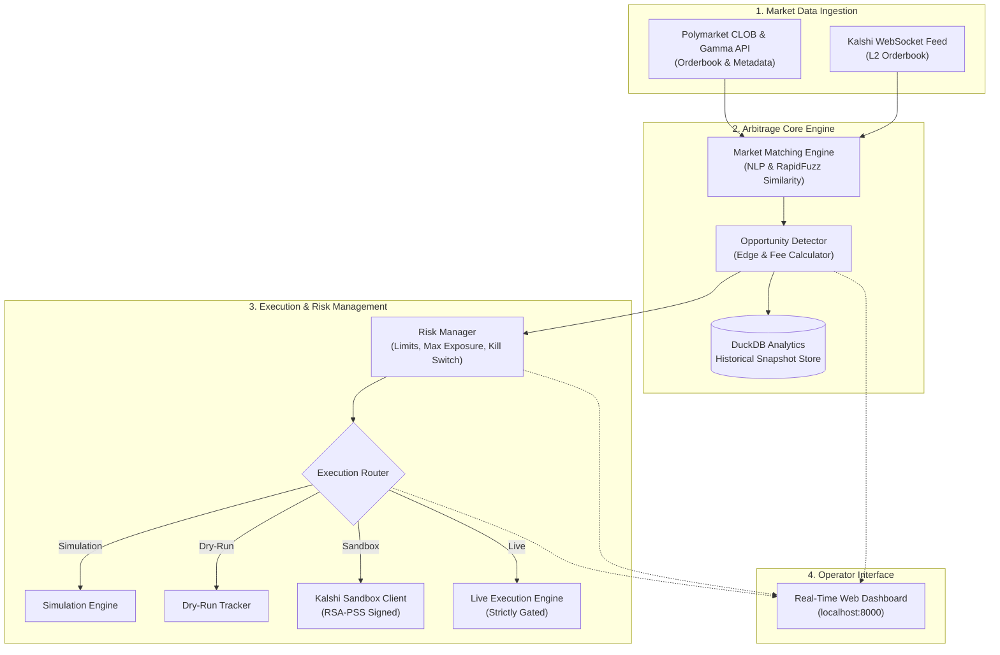
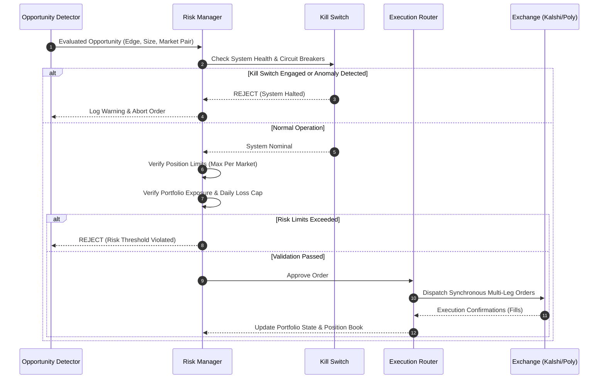

# kalshi-arb ⚡📈

> **An instrumented detection, testing, and execution harness for quantitative prediction market arbitrage across Kalshi and Polymarket.**

[](https://github.com/InfinitelyFinite/kalshi-arb)
[](https://www.python.org/)
[](https://fastapi.tiangolo.com/)
[](https://duckdb.org/)
[](LICENSE)

---

## 📌 Executive Summary

**kalshi-arb** is a self-contained, low-latency trading and analytics system that continuously monitors prediction markets on **Kalshi** (CFTC-regulated exchange) and **Polymarket** (decentralized CLOB). It detects pricing inefficiencies, calculates risk-adjusted edges, records historical orderbook snapshots for quantitative research, and provides an operator dashboard with tiered execution autonomy.

Rather than acting as a reckless black-box trading bot, the project is engineered as an **instrumented detection + testing harness** designed to rigorously quantify and backtest alpha before capital is ever deployed.

---

## ⚙️ How Arbitrage Works in Binary Prediction Markets

Both Kalshi and Polymarket list **binary outcome contracts** ($0.00 to $1.00) where the winning outcome settles at exactly **$1.00** and the losing outcome settles at **$0.00**.

Because $\text{Payout}(\text{YES}) + \text{Payout}(\text{NO}) = \$1.00$, the system exploits two forms of structural mispricing:

### 1. Intra-Market Arbitrage (Single Exchange)
When orderbook liquidity is thin, the sum of the best ask prices for both outcomes temporarily dips below $1.00:
$$\text{BestAsk}(\text{YES}) + \text{BestAsk}(\text{NO}) < \$1.00 - \text{Fees}$$
*Buying both sides on the same exchange locks in an immediate risk-free settlement spread.*

### 2. Cross-Platform Arbitrage (Kalshi vs. Polymarket)
For identical real-world events (e.g., Fed interest rate decisions, CPI releases, election outcomes), differing participant bases and liquidity pools create pricing divergence:
$$\text{BestAsk}_{\text{Kalshi}}(\text{YES}) + \text{BestAsk}_{\text{Polymarket}}(\text{NO}) < \$1.00 - \text{Fees}$$

#### Payoff Matrix Example
Suppose an identical event trades at the following ask prices:
- **Kalshi (YES):** $0.45
- **Polymarket (NO):** $0.48
- **Total Initial Capital:** $\$0.45 + \$0.48 = \mathbf{\$0.93}$

| Event Outcome | Kalshi Payout (YES) | Polymarket Payout (NO) | Total Payout | Net Profit |
| :--- | :--- | :--- | :--- | :--- |
| **YES Wins** | $\$1.00$ | $\$0.00$ | **$\$1.00$** | **$+\$0.07 (+7.5\%)$** |
| **NO Wins** | $\$0.00$ | $\$1.00$ | **$\$1.00$** | **$+\$0.07 (+7.5\%)$** |

*Regardless of what happens in the real world, the bundle yields a deterministic \$1.00 payout.*

---

## 🏗️ System Architecture



---

## 🔒 Order Execution & Safety Layer

Every trade candidate must pass through a strict, multi-stage risk validation pipeline before execution:



---

## 🎛️ Tiered Execution Modes

The engine can switch between 4 execution tiers using a single configuration parameter (`trading_mode`), eliminating code modifications:

| Mode | Market Data Source | Order Execution Mechanics | Real Capital Risk | Purpose |
| :--- | :--- | :--- | :--- | :--- |
| **`simulation`** | Synthetic / Injected | Virtual simulated fills | **$0 (Zero)** | End-to-end unit and stress testing of matching algorithms. |
| **`dry_run`** | Real Live WebSocket / REST | Paper trading; virtual ledger tracking | **$0 (Zero)** | Strategy validation against real market dynamics and slippage. |
| **`sandbox`** | Live Kalshi Demo API | Authenticated orders on Kalshi Sandbox | **$0 (Demo Funds)** | Live exchange connectivity & RSA-PSS cryptographic validation. |
| **`live`** *(Gated)* | Production Exchange APIs | Real order execution via production accounts | **Active Capital** | Scaled production deployment with full risk circuit breakers. |

---

## 🔬 Historical Research & Replay Engine

Every orderbook tick and detected spread is persisted into a local, columnar **DuckDB** database. This enables quantitative research and strategy backtesting:
- **Opportunity Frequency:** How often do genuine arbitrage opportunities appear per day?
- **Duration & Half-Life:** How many milliseconds/seconds does a mispriced spread last before being corrected?
- **Depth & Capacity:** How much volume can be absorbed before slippage eliminates the edge?

---

## 💻 Tech Stack

- **Core Runtime:** Python 3.12+ (Asyncio, Typing, Dataclasses)
- **API & Cryptography:** `httpx` (HTTP/2 async client), `cryptography` (RSA-PSS SHA-256 signing)
- **Data & Matching:** `pydantic` v2 (validation & config), `rapidfuzz` (string similarity), `pyyaml`
- **Analytics Store:** `duckdb` (columnar embedded OLAP database)
- **Web & Dashboard:** `fastapi`, `uvicorn`, WebSockets, Vanilla CSS / Modern UI
- **Testing:** `pytest`, `pytest-asyncio`

---

## 🚀 Getting Started

### 1. Clone & Set Up Environment
```bash
git clone https://github.com/InfinitelyFinite/kalshi-arb.git
cd kalshi-arb

# Create and activate virtual environment
python3 -m venv .venv
source .venv/bin/activate

# Install dependencies
pip install -r requirements.txt
```

### 2. Configure Credentials
Copy the example environment file and configure your Kalshi Sandbox API keys:
```bash
cp .env.example .env
```
In `.env`:
```bash
# Kalshi Sandbox Credentials
KALSHI_SANDBOX_KEY_ID=your_sandbox_api_key_id
KALSHI_SANDBOX_PRIVATE_KEY_PATH=/path/to/kalshi_private_key.pem
```

### 3. Run Test Suite
```bash
# Run all unit tests
pytest -v
```

### 4. Run Sandbox Authentication Smoke Test
```bash
python scripts/test_sandbox_connection.py
```

---

## ⚖️ Disclaimer

*This project is developed for quantitative research, algorithmic trading education, and software engineering demonstration purposes. Prediction market trading involves financial risk. Always ensure compliance with all applicable local laws, regulations, and exchange terms of service.*
